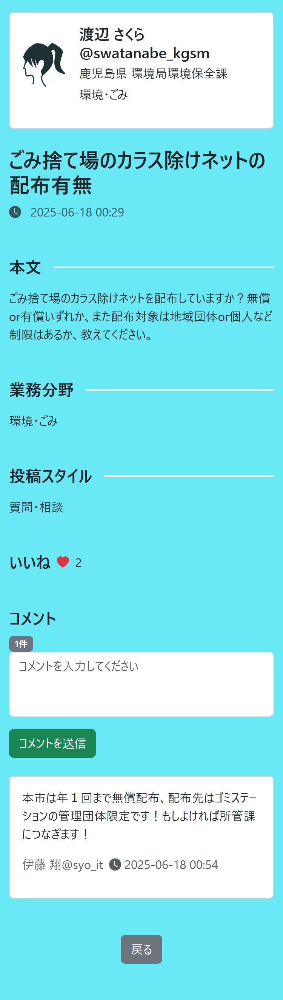

# Komunet

## 概要
Komunetは、全国の地方自治体に勤務する公務員同士がつながり、情報交換や交流ができるSNSアプリです。気軽に相談や事例共有、PRなどを行うことを目的としています。
## ターゲットユーザ
全国の地方自治体に勤務する公務員
## 主な利用シーン
自治体に勤務する職員間で情報交換や相談、交流等を行うことを想定しています。
## 制作のきっかけ
私は地方公務員として9年間勤務する中で、他の自治体職員と気軽に交流・情報交換を行う機会が極めて少ないことに課題を感じていました。
自治体業務は性質上あまりオープンな世界ではなく、特に機密情報を多く扱う立場から、情報交換の手段は「会議」「正式な照会文書」「メール」がほとんどであり、それらは心理的にも手続き的にもハードルが高いのが現状です。
例えば「他都市ではどのような取り組み・工夫をしているのか、ちょっと知りたい」というだけでも、正式な手続きを経て照会をかける必要があり、それが日々の業務負担の一因にもなっています。 
このような現状を少しでも改善したいという思いから、地方自治体の職員同士が気軽に繋がれるアプリを制作しました。
もちろん、個人情報など機密情報の取り扱いには最大限の注意が必要であるため、ユーザーは投稿内容について十分な注意を払う必要があります。しかし、業務に関するノウハウや悩み、工夫、事例の共有、ＰＲなどは、より気軽に共有できる場があっていいと考えています。 
このアプリを通じて、些細なやりとりや気軽な相談が、企画・政策立案や業務改善のヒントとなり、また同じような悩みを共有することで少しでも気持ちが軽くなる、そんな場になればと考えています。
## 利用方法
### ユーザー新規登録またはログイン

### 記事を投稿

### 記事を閲覧・いいね・コメント

### DM

## 機能一覧
- ユーザー登録・ログイン 
- プロフィール編集 
- 投稿 
- コメント 
- フォロー 
- いいね 
- DM 

## 開発環境
- フロントエンド：HTML/CSS/JavaScript 
- バックエンド：Ruby on Rails 
